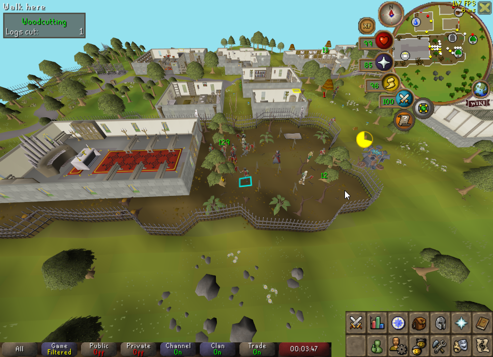

# Tree Counter

A RuneLite plugin to track the number of players chopping a tree.

## Known Issues

- Edge case when a player quickly switches the tree they're chopping, it'll fail to register the new tree
    - This is because we utilize animations for tracking, and sometimes the chopping animation doesn't stop even if you
      switch trees.
- Rare instances where overlay will remain even when there are no people chopping the tree

## Future Plans

- When part 2 of the forestry event is release, add the new axe animation ids to #isWoodcutting